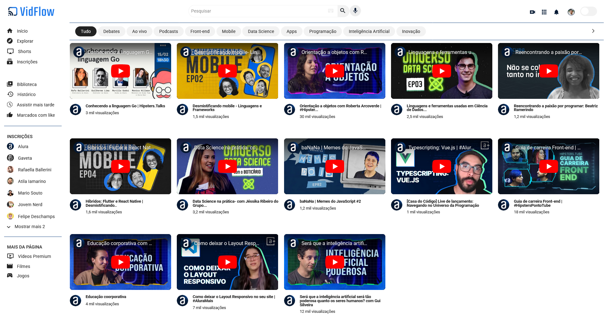

# Projeto VidFlow - Plataforma de Vídeos - com Vite.dev



## Menu

- [Layout](#layout)
- [Descrição](#descrição)
- [Tecnologias Utilizadas](#tecnologias-utilizadas)
- [Funcionalidades](#funcionalidades)
- [Como Instalar e Rodar o Projeto](#como-instalar-e-rodar-o-projeto)
- [Estrutura de Pastas](#estrutura-de-pastas)
- [Projeto ao Vivo](#projeto-ao-vivo)
- [Licença](#licença)
- [Autor](#autor)

## Layout

[Layout no Figma](https://www.figma.com/design/a0crwitCtGmNIQW0RVIs5H/VidFlow-%7C-Curso-Js---Consumindo-dados-de-uma-API)

## Descrição

O VidFlow é uma plataforma de compartilhamento de vídeos que permite aos usuários pesquisar, filtrar e assistir a diversos conteúdos em diferentes categorias. Com uma interface intuitiva e recursos avançados de filtragem, o VidFlow oferece uma experiência de visualização personalizada e eficiente.

## Tecnologias Utilizadas

- HTML
- CSS
- JavaScript
- Vite
- Axios
- JSON Server

## Funcionalidades

- **Pesquisa de Vídeos:** Os usuários podem pesquisar vídeos usando a barra de pesquisa, que filtra os resultados com base no título do vídeo.
- **Filtro por Categoria:** Os usuários podem filtrar os vídeos por categorias, como "Tudo", "Debates", "Ao vivo", "Podcasts", "Front-end", "Mobile", "Data Science", "Apps", "Programação", "Inteligência Artificial" e "Inovação".
- **Exibição de Vídeos:** Os vídeos são exibidos em uma lista, com informações como título, descrição, imagem do canal e categoria.
- **Marcação de Botão Ativo:** Ao clicar em uma categoria, o botão correspondente é marcado como "ativo", indicando a categoria selecionada.

## Como Instalar e Rodar o Projeto

1. Certifique-se de ter o Node.js instalado em seu sistema.
   - Caso não tenha o Node.JS instalado em sua máquina, [clique aqui](https://www.alura.com.br/artigos/como-instalar-node-js-windows-linux-macos?srsltid=AfmBOoqrf2oTntr5P-w5ZY5VUWK6GzdLMFWE9aT0Q8v-0zseFXsRvNpG) para ir à um artigo que irá te explicar como instalar o Node.JS.
2. Clone este repositório em sua máquina local.
3. Navegue até o diretório do projeto e execute o seguinte comando para instalar as dependências:
   ```bash
   npm install
   ```
4. Em seguida, execute o seguinte comando para iniciar o servidor JSON:
   ```bash
   npm run api-local
   ```
   - O comando json-server irá iniciar o servidor;
   - O comando --watch mantém ele ativo e "observando" qualquer alteração no arquivo JSON para atualizar a base de dados;
   - O caminho backend/videos.json é o arquivo que estamos usando como base de dados para os vídeos;
5. Em outra janela do terminal, execute o seguinte comando para iniciar o servidor de desenvolvimento com Vite:
   ```bash
   npm run dev
   ```
6. Abra o navegador e acesse o endereço fornecido pelo Vite (geralmente **http://localhost:3000**).

## Estrutura de Pastas

```
projeto-vidflow-vite/
├── backend/
│   └── videos.json
├── css/
│   ├── estilos.css
│   ├── flexbox.css
│   └── reset.css
├── dist/
├── img/
│   ├── sidebar/
│   │   ├── airplay.png
│   │   ├── Avatar_Alura.png
│   │   ├── Avatar_Atila.png
│   │   ├── Avatar_Deschamps.png
│   │   ├── Avatar_Gaveta.png
│   │   ├── Avatar_Jovem_Nerd.png
│   │   ├── Avatar_Rafa.png
│   │   ├── Avatar_Souto.png
│   │   ├── explore.png
│   │   ├── history_toggle_off.png
│   │   ├── history.png
│   │   ├── home.png
│   │   ├── keyboard_arrow_down.png
│   │   ├── movie.png
│   │   ├── ondemand_video.png
│   │   ├── sports_esports.png
│   │   ├── subscriptions.png
│   │   ├── thumb_up_alt.png
│   │   └── video_library.png
│   ├── topbar/
│   │   ├── apps.png
│   │   ├── Avatar.png
│   │   ├── keyboard.png
│   │   ├── Mic.png
│   │   ├── notifications.png
│   │   ├── search.png
│   │   └── video_call.png
│   ├── videos/
│   │   └── Ellipse 11.png
│   ├── arrow_forward_ios.png
│   ├── Favicon.png
│   └── VidFlow--Logo-light-mode.png
├── node_modules/
├── .gitignore
├── eslint.config.mjs
├── index.html
├── package-lock.json
├── package.json
├── README.md
└── script.js
```

## Projeto ao Vivo

Você pode ver o projeto funcionando ao vivo no seguinte link: [VidFlow ao Vivo](https://projeto-vidflow-vite-three.vercel.app/)

## Licença

Este projeto está licenciado sob a Licença MIT. Veja o arquivo [LICENSE](https://github.com/Melksedeque/projeto-vidflow-vite?tab=MIT-1-ov-file) para mais detalhes.

## Autor

- GitHub - [Melksedeque Silva](https://github.com/Melksedeque/)
- FrontEndMentor - [@Melksedeque](https://www.frontendmentor.io/profile/Melksedeque)
- Twitter / X - [@SouzaMelk](https://x.com/SouzaMelk)
- LinkedIn - [Melksedeque Silva](https://www.linkedin.com/in/melksedeque-silva/)
